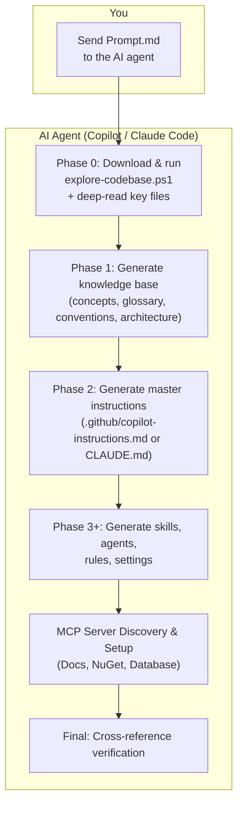
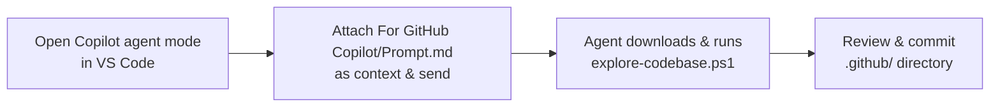
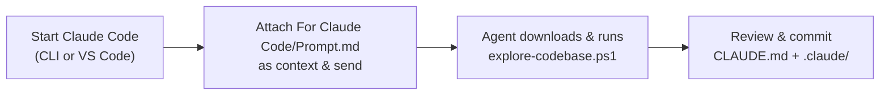

One prompt to bootstrap a full AI agent setup for any .NET repository. Supports both **GitHub Copilot** and **Claude Code**.

Send the appropriate prompt to the AI agent — it automatically downloads `explore-codebase.ps1`, scans the codebase, and generates a complete configuration: architecture docs, knowledge base, skills, agents, and conventions. No manual setup, no generic boilerplate.

## How it works

1. **Send** `Prompt.md` (from `For GitHub Copilot/` or `For Claude Code/`) to the AI agent
2. The agent **downloads** `explore-codebase.ps1`, scans the repo, reads source files, then generates everything across multiple phases
3. **Review & commit** the generated output (`.github/` for Copilot, `CLAUDE.md` + `.claude/` for Claude Code)

## What `explore-codebase.ps1` detects

| Category | Details |
|---|---|
| **Projects** | `.sln` / `.csproj` files, target frameworks, NuGet packages, project references |
| **Database** | Engine (SQL Server, PostgreSQL, MySQL, SQLite, Oracle, Snowflake, Azure SQL) and connection strings |
| **Data access** | EF Core (DbContext, migrations, entities), Dapper, ADO.NET, RepoDB, Linq2db |
| **Frontend** | Framework, state management, UI library, build tool, test framework via `package.json` |
| **Tests** | Test projects and frameworks (xUnit, NUnit, MSTest) |
| **CI/CD** | Pipeline and DevOps configuration files |
| **Conventions** | File-scoped namespaces, nullable, records, primary constructors, naming patterns |
| **Structure** | Directory tree (depth 4), entry points (`Program.cs`, `Startup.cs`), config files |

Shared across both prompts — same script, same output.

## Usage Guidance

### GitHub Copilot

Generated output:
- `.github/copilot-instructions.md` — master instructions (single source of truth)
- `.github/knowledge-base/` — concepts, glossary, entity relationships, conventions, architecture
- `.github/prompts/*.prompt.md` — skill playbooks for recurring tasks
- `.github/agents/*.agent.md` — specialized sub-agents with scoped roles

### Claude Code

Generated output:
- `CLAUDE.md` — master instructions loaded automatically every session
- `.claude/knowledge-base/` — concepts, glossary, entity relationships, conventions, architecture
- `.claude/rules/*.md` — modular coding standards (auto-loaded or path-scoped)
- `.claude/skills/*/SKILL.md` — skill playbooks invokable via `/skill-name`
- `.claude/agents/*.md` — specialized subagents with isolated context and restricted tools
- `.claude/settings.json` — permission rules for allowed/denied tools and file access
